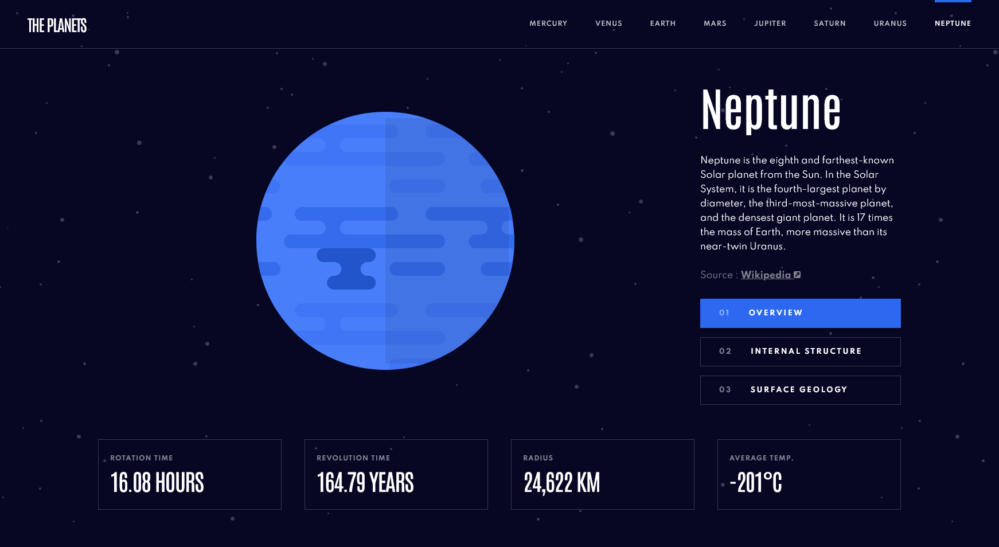
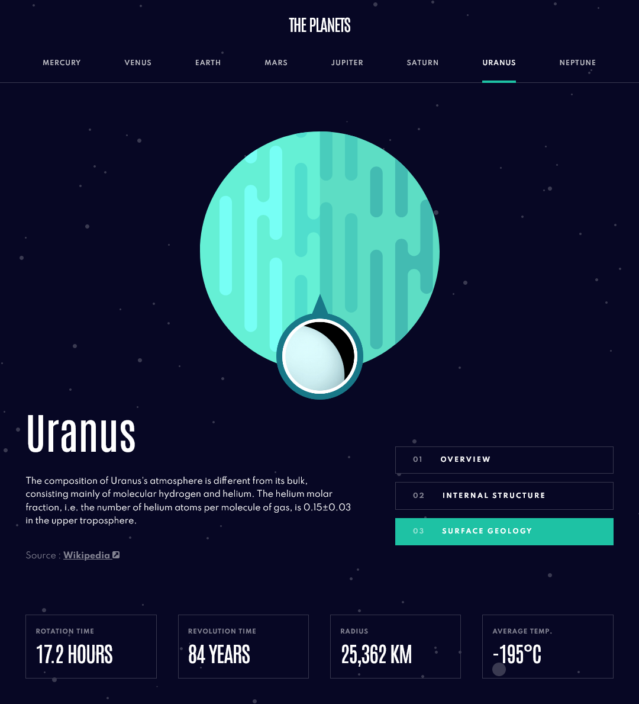
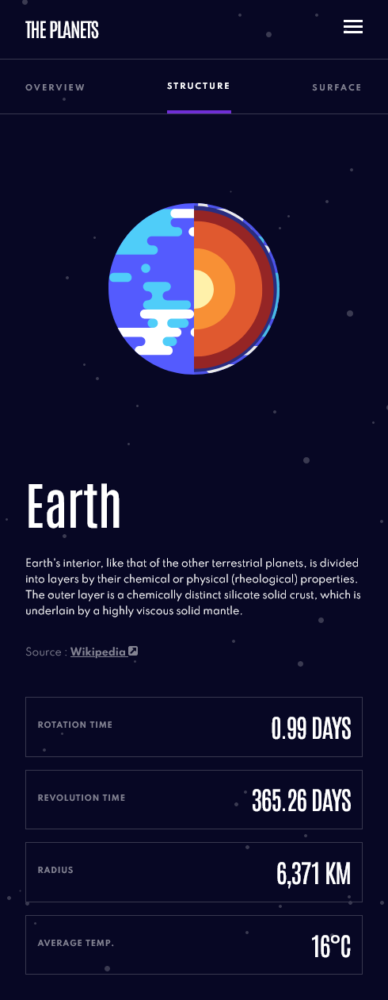

# Planet Facts Site - Frontend Mentor Project

### Links

-   Live Site URL: [Planet Facts](https://lucid-einstein-f5da70.netlify.app/)
-   Solution URL: [Github](https://github.com/Euuphi/planet-facts)

This is a solution to the [Planets Fact site challenge on Frontend Mentor](https://www.frontendmentor.io/challenges/planets-fact-site-gazqN8w_f). Frontend Mentor challenges help you improve coding skills by building realistic projects.

## Table of contents

-   [Overview](#overview)
    -   [The challenge](#the-challenge)
    -   [Screenshots](#screenshots)
-   [My process](#my-process)
    -   [Built with](#built-with)
-   [Author](#author)

## Overview

### The challenge

Users should be able to:

-   View the optimal layout for the app depending on their device's screen size
-   See hover states for all interactive elements on the page
-   View each planet page and toggle between "Overview", "Internal Structure", and "Surface Geology"

### Screenshots

#### Desktop

#### Tablet

#### Mobile

## My process

### Built with

-   [React](https://reactjs.org/) - JavaScript Framework
-   [Styled Components](https://styled-components.com/) - CSS styles
-   [React Router](https://reactrouter.com/) - Multi page routing
-   [Material UI](https://mui.com/) - Responsive design
-   Semantic HTML5 markup
-   Flexbox
-   CSS Grid
-   Desktop-first workflow

## Author

-   Github - [Steven Nguyen](https://github.com/Euuphi)
